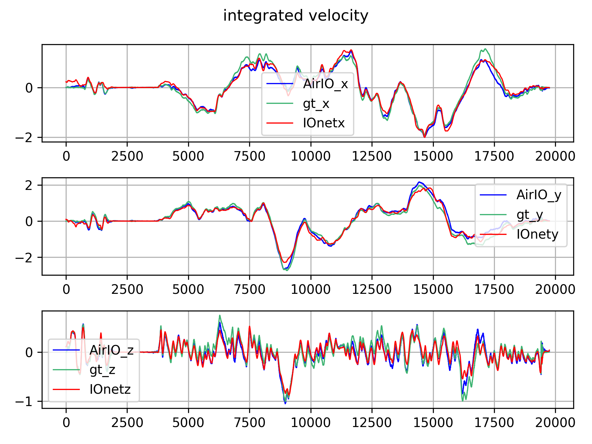
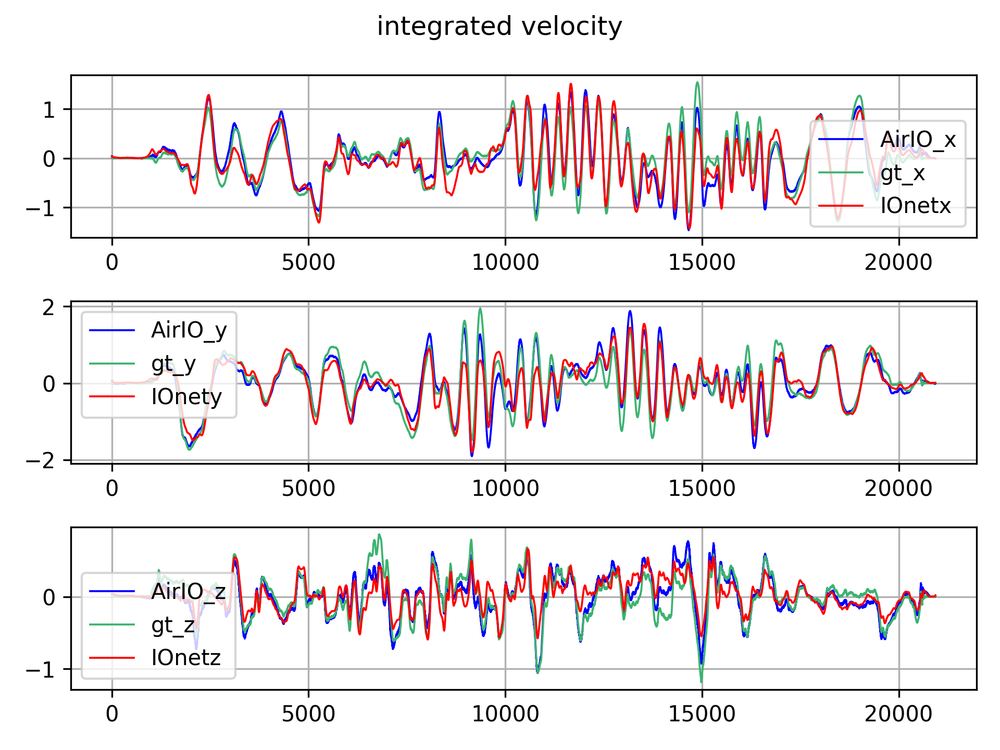

[comment]: <> 

<!-- PROJECT LOGO -->

<p align="center">

  <h1 align="center"> AirIO: Learning Inertial Odometry with Enhanced IMU Feature Observability
  </h1>

[comment]: <> (  <h2 align="center">PAPER</h2>)
  <h3 align="center">
  <a href="https://kwanwaipang.github.io/AirIO/">Blog</a> 
  | <a href="https://github.com/Air-IO/Air-IO">Original Github Page</a>
  | <a href="https://github.com/KwanWaiPang/AirIMU_comment">AirIMU_comment</a>
  </h3>
  <div align="justify">
  </div>

<br>

<!-- ~~~
rm -rf .git
git init
git add .
git commit -m "first commit"
git branch -M main
git remote add origin https://github.com/KwanWaiPang/AirIO_Comment.git
git push -u origin main
~~~ -->

# 配置安装
```bash
conda create -n airio python=3.10.11
# conda remove --name airio --all
conda activate airio

#同样依赖于pypose
# 安装系列依赖
pip install matplotlib==3.8.4
pip install numpy==2.2.2
pip install pyhocon==0.3.61
pip install pypose==0.6.8
pip install pyproj==3.7.0
pip install PyYAML==6.0.2
pip install scipy==1.15.1
pip install simplekml==1.3.6
# pip install torch==2.5.1 #重复安装了~
pip install tqdm==4.66.5
pip install wandb==0.19.4

```

# 下载数据集
* [Euroc](https://projects.asl.ethz.ch/datasets/doku.php?id=kmavvisualinertialdatasets),路径在```/home/gwp/AirIMU/Euroc_dataset```
* [Blackbird dataset](http://blackbird-dataset.mit.edu/BlackbirdDatasetData/),路径在```/home/gwp/Air-IO/Blackbird_dataset```

# 获取预训练模型
* 作者提到要运行EKF模式，是需要下载 AirIMU results的，它提供了IMU预积分以及uncertainty（这样来说相当于得先用AirIMU来处理数据，因此应该属于是offline的~）
* 而如果要用其他数据集，可能就是要重新训练AirIMU了~

| Datasets               | AirIO Pre-trained Models & Results| AirIMU Pre-trained Models & Results | 
| :----------------: | :------: | :----: |
| EuRoC       |  [AirIO Model](https://github.com/Air-IO/Air-IO/releases/download/AirIO/AirIO_EuRoC.zip)   | [AirIMU](https://github.com/Air-IO/Air-IO/releases/download/AirIMU/AirIMU_EuRoC.zip)|
| Blackbird           |   [AirIO Model](https://github.com/Air-IO/Air-IO/releases/download/AirIO/AirIO_Blackbird.zip)  | [AirIMU](https://github.com/Air-IO/Air-IO/releases/download/AirIMU/AirIMU_blackbird.zip)|
| Pegasus    |  [AirIO Model](https://github.com/Air-IO/Air-IO/releases/download/AirIO/AirIO_Pegasus.zip)   | [AirIMU](https://github.com/Air-IO/Air-IO/releases/download/AirIMU/AirIMU_pegasus.zip)|

> [!NOTE]
> Each AirIMU Results pickle file contains raw IMU correction; 
> Each Orientations pickle file contains two critical keys: airimu_rot for AirIMU-corrected orientation, inte_rot for raw IMU integrated orientation.

# 测试Euroc
* 网络输出会保存为`net_output.pickle` 文件（路径在`AirIO_EuRoC/AirIO_checkpoint/net_output.pickle`）
* 记得修改`configs/datasets/EuRoC/Euroc_body.conf`中关于数据的路径~
* `configs/EuRoC/motion_body_rot.conf`中的['general']['exp_dir']也要修改（这是模型的路径）
* AirIO network supports three orientation input modes:
    * Default: using Ground-truth orientation (no setup required)
    * Switch modes: modify the rot_type and rot_path in the dataset config file configs/datasets/EuRoC/Euroc_body.conf. You can use AirIMU-corrected Orientation (rot_type: airimu) or raw IMU preintegration orientation (rot_type: integration). 这部分的操作则是需要AirIMU的输出结果
    * Download precomputed rotation files (e.g. orientation_output.pickle) from the Download Datasets section and update the rot_path.
~~~
python inference_motion.py --config configs/EuRoC/motion_body_rot.conf
~~~

## Evaluate & Visualize Network Predictions
* 通过下面命令来验证网络对于motion的估算效果并且画出轨迹

```bash
# 注意：删除反斜杠后的空格，确保每行以 \ 结尾且没有其他字符：
python evaluation/evaluate_motion.py \
    --dataconf configs/datasets/EuRoC/Euroc_body.conf \
    --exp AirIO_EuRoC/AirIO_checkpoint \
    --savedir ./result/loss_result \
    --seqlen 1000

# --seq is the segment length (in frames) for RTE calculation
# --exp is the Path for AirIO netoutput

# 下面两种都会出现报错的情况，还未fix
# `AirIO_EuRoC/network_output_using_airimuRot/net_output.pickle`中有用airimu作为rotation的网络输出
python evaluation/evaluate_motion.py \
    --dataconf configs/datasets/EuRoC/Euroc_body.conf \
    --exp AirIO_EuRoC/network_output_using_airimuRot \
    --savedir ./result/loss_result_airimuRot \
    --seqlen 1000

# `AirIO_EuRoC/network_output_using_gtRot/net_output.pickle`中有用GT作为rotation的网络输出
python evaluation/evaluate_motion.py \
    --dataconf configs/datasets/EuRoC/Euroc_body.conf \
    --exp AirIO_EuRoC/network_output_using_gtRot \
    --savedir ./result/loss_result_gtRot \
    --seqlen 1000
```

### 自己生成的效果
* 输出的loss结果
```json
[
    {
        "name": "MH_02_easy",
        "ATE": 2.530659436584817,
        "AVE": 0.18877704889692698,
        "RP_RMSE": 0.972156050539075,
        "Integration Method": "==============Integration==============",
        "Integration pos_err": 35431.88813105013,
        "Integration vel_err": 9.474668063515825,
        "AirIO Method": "==============AirIO==============",
        "AirIO pos_err": 2.2516072971978067,
        "AirIO vel_err": 0.807469868411387
    },
    {
        "name": "MH_04_difficult",
        "ATE": 2.2503146961385756,
        "AVE": 0.22445296159494285,
        "RP_RMSE": 1.0092401639709976,
        "Integration Method": "==============Integration==============",
        "Integration pos_err": 17034.383004241186,
        "Integration vel_err": 9.248072741739545,
        "AirIO Method": "==============AirIO==============",
        "AirIO pos_err": 2.111607675401745,
        "AirIO vel_err": 0.8878740819530951
    },
    {
        "name": "V1_03_difficult",
        "ATE": 3.1073632144485637,
        "AVE": 0.38263154057907856,
        "RP_RMSE": 1.511648049992939,
        "Integration Method": "==============Integration==============",
        "Integration pos_err": 16898.100169538437,
        "Integration vel_err": 8.73100262917092,
        "AirIO Method": "==============AirIO==============",
        "AirIO pos_err": 2.672330765766064,
        "AirIO vel_err": 1.3228342084701386
    },
    {
        "name": "V2_02_medium",
        "ATE": 4.309661365752476,
        "AVE": 0.33851355967935326,
        "RP_RMSE": 1.263009365746855,
        "Integration Method": "==============Integration==============",
        "Integration pos_err": 11761.063571576806,
        "Integration vel_err": 8.452118708802605,
        "AirIO Method": "==============AirIO==============",
        "AirIO pos_err": 3.5996171944071746,
        "AirIO vel_err": 1.1390835097147682
    },
    {
        "name": "V1_01_easy",
        "ATE": 6.52871041920713,
        "AVE": 0.2774450150679226,
        "RP_RMSE": 1.2017184870731785,
        "Integration Method": "==============Integration==============",
        "Integration pos_err": 24396.605673957074,
        "Integration vel_err": 10.97922060906811,
        "AirIO Method": "==============AirIO==============",
        "AirIO pos_err": 5.919706406806912,
        "AirIO vel_err": 1.0943105537291968
    }
]
```

<div align="center">
  <table style="border: none; background-color: transparent;">
    <tr align="center">
      <td style="width: 50%; border: none; padding: 0.01; background-color: transparent; vertical-align: middle;">
        
        MH_02_easy_state
      </td>
      <td style="width: 50%; border: none; padding: 0.01; background-color: transparent; vertical-align: middle;">
        
        MH_04_difficult_state
      </td>
    </tr>
    <tr align="center">
      <td style="width: 50%; border: none; padding: 0.01; background-color: transparent; vertical-align: middle;">
        
        V1_01_easy_state
      </td>
      <td style="width: 50%; border: none; padding: 0.01; background-color: transparent; vertical-align: middle;">
        
        V1_03_difficult_state
      </td>
    </tr>
  </table>

  
  
  <figcaption>
   V2_02_medium_state
  </figcaption>
</div>

* 虽然看似有不少的drift，但是跟IMU预积分比起来少很多，且此处仅仅是用了AirIO的motion network而已（应该是用速度积分计算轨迹的）
* 上图应该主要对比的是估算的速度的情况

## 运行EKF
* EKF的结果会保存为`${SEQUENCE_NAME}_ekf_poses.npy` and `${SEQUENCE_NAME}_ekf_results.npy`
```bash
python EKF/IMUofflinerunner.py \
      --dataconf configs/datasets/EuRoC/Euroc_body.conf \
      --exp AirIO_EuRoC/network_output_using_gtRot \
      --airimu_exp AirIMU_EuRoC \
      --savedir ./EKFresult/loss_result

# --airimu_exp ${AirIMU_RESULT_PATH}      
```
* 可视化结果如下
    1. EKF估算的轨迹 vs 真值轨迹
    2. EKF的bias
    3. 估算角度 vs 真值 
    4. 估算位置（蓝色） vs 速度积分估算的位置（红色） vs 真值（绿色）
<div align="center">
  <table style="border: none; background-color: transparent;">
    <tr align="center">
      <td style="width: 50%; border: none; padding: 0.01; background-color: transparent; vertical-align: middle;">
        
        ekf_result
      </td>
      <td style="width: 50%; border: none; padding: 0.01; background-color: transparent; vertical-align: middle;">
        
        bias
      </td>
    </tr>
    <tr align="center">
      <td style="width: 50%; border: none; padding: 0.01; background-color: transparent; vertical-align: middle;">
        
        EKF_rot_orientation_compare
      </td>
      <td style="width: 50%; border: none; padding: 0.01; background-color: transparent; vertical-align: middle;">
        
        EKF_vel
      </td>
    </tr>
  </table>
  <figcaption>
   MH_02_easy
  </figcaption>
</div>

<div align="center">
  <table style="border: none; background-color: transparent;">
    <tr align="center">
      <td style="width: 50%; border: none; padding: 0.01; background-color: transparent; vertical-align: middle;">
        
        ekf_result
      </td>
      <td style="width: 50%; border: none; padding: 0.01; background-color: transparent; vertical-align: middle;">
        
        bias
      </td>
    </tr>
    <tr align="center">
      <td style="width: 50%; border: none; padding: 0.01; background-color: transparent; vertical-align: middle;">
        
        EKF_rot_orientation_compare
      </td>
      <td style="width: 50%; border: none; padding: 0.01; background-color: transparent; vertical-align: middle;">
        
        EKF_vel
      </td>
    </tr>
  </table>
  <figcaption>
   MH_04_difficult
  </figcaption>
</div>

<div align="center">
  <table style="border: none; background-color: transparent;">
    <tr align="center">
      <td style="width: 50%; border: none; padding: 0.01; background-color: transparent; vertical-align: middle;">
        
        ekf_result
      </td>
      <td style="width: 50%; border: none; padding: 0.01; background-color: transparent; vertical-align: middle;">
        
        bias
      </td>
    </tr>
    <tr align="center">
      <td style="width: 50%; border: none; padding: 0.01; background-color: transparent; vertical-align: middle;">
        
        EKF_rot_orientation_compare
      </td>
      <td style="width: 50%; border: none; padding: 0.01; background-color: transparent; vertical-align: middle;">
        
        EKF_vel
      </td>
    </tr>
  </table>
  <figcaption>
   V1_03_difficult
  </figcaption>
</div>

<div align="center">
  <table style="border: none; background-color: transparent;">
    <tr align="center">
      <td style="width: 50%; border: none; padding: 0.01; background-color: transparent; vertical-align: middle;">
        
        ekf_result
      </td>
      <td style="width: 50%; border: none; padding: 0.01; background-color: transparent; vertical-align: middle;">
        
        bias
      </td>
    </tr>
    <tr align="center">
      <td style="width: 50%; border: none; padding: 0.01; background-color: transparent; vertical-align: middle;">
        
        EKF_rot_orientation_compare
      </td>
      <td style="width: 50%; border: none; padding: 0.01; background-color: transparent; vertical-align: middle;">
        
        EKF_vel
      </td>
    </tr>
  </table>
  <figcaption>
   V2_02_medium
  </figcaption>
</div>

* 最后的V1_01_easy报错如下
~~~
odict_keys(['mode', 'coordinate', 'rot_type', 'rot_path', 'data_list', 'gravity'])
ConfigTree([('name', 'Euroc'), ('window_size', 1000), ('step_size', 1000), ('data_root', '/home/gwp/AirIMU/Euroc_dataset'), ('data_drive', ['V1_01_easy'])])
/home/gwp/AirIMU/Euroc_dataset V1_01_easy
loaded: /home/gwp/AirIMU/Euroc_dataset, interpolate: True, gravity: 9.81007
Traceback (most recent call last):
  File "/home/gwp/Air-IO/EKF/IMUofflinerunner.py", line 174, in <module>
    dataset_inf = SeqInfDataset(data_conf.data_root, data_name, inference_state, device = args.device, name = data_conf.name,duration=1, step_size=1, drop_last=False, conf = dataset_conf)
  File "/home/gwp/Air-IO/datasets/dataset.py", line 130, in __init__
    self.data["acc"][:-1] += inference_state["correction_acc"][:, time_cut:].cpu()[0]
RuntimeError: The size of tensor a (28711) must match the size of tensor b (28940) at non-singleton dimension 0
~~~

## Evaluate & Visualize EKF Results
```bash
python evaluation/evaluate_ekf.py \
    --dataconf configs/datasets/EuRoC/Euroc_body.conf \
    --exp EKFresult/loss_result \
    --savedir ./result/loss_result_ekf \
    --seqlen 1000
```

```json
[
    {
        "name": "MH_02_easy",
        "ATE(EKF)": 2.4776350567640453,
        "RTE(EKF)": 0.8392048606301833,
        "RP_RMSE(EKF)": 0.986514639276038
    },
    {
        "name": "MH_04_difficult",
        "ATE(EKF)": 2.3080264050205286,
        "RTE(EKF)": 0.8697517581648648,
        "RP_RMSE(EKF)": 1.0046212473704987
    },
    {
        "name": "V1_03_difficult",
        "ATE(EKF)": 3.050263789492288,
        "RTE(EKF)": 1.3646776743637254,
        "RP_RMSE(EKF)": 1.5521645175050485
    },
    {
        "name": "V2_02_medium",
        "ATE(EKF)": 4.20582509824693,
        "RTE(EKF)": 1.1778671729026637,
        "RP_RMSE(EKF)": 1.3132037593617787
    }
]
```